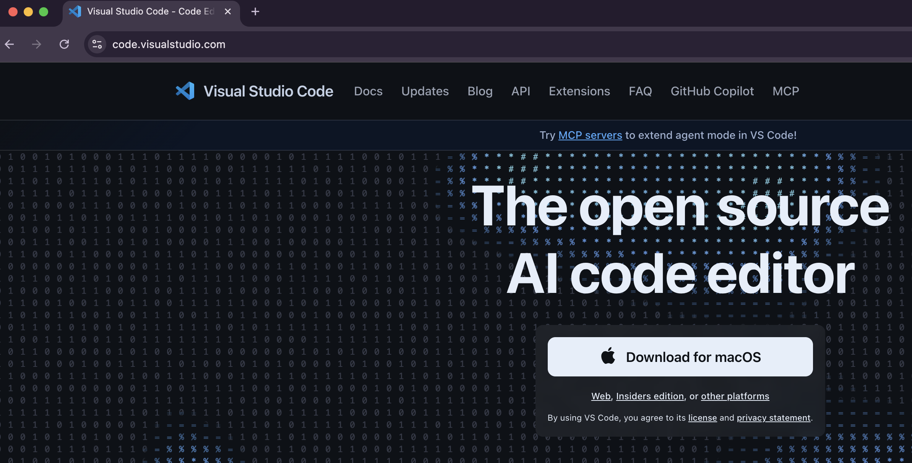
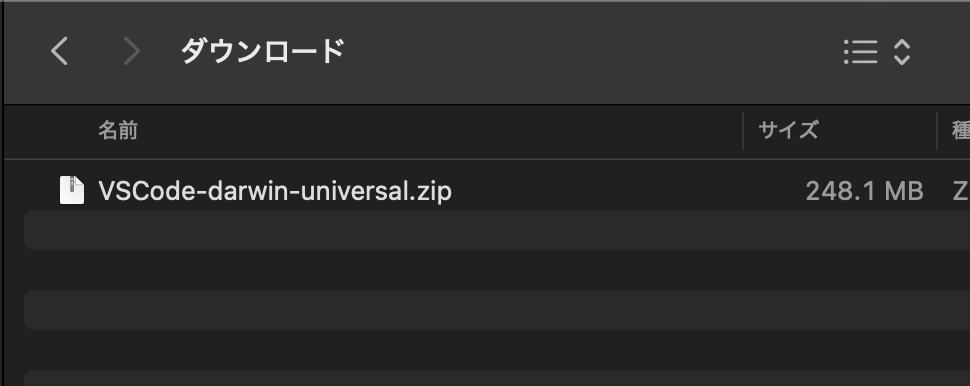
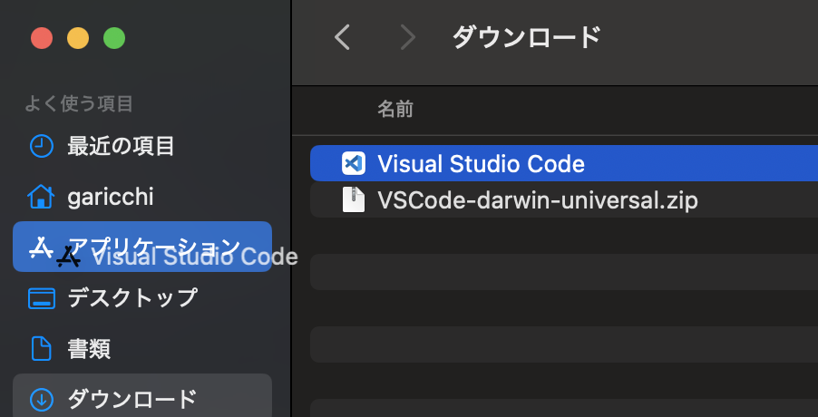
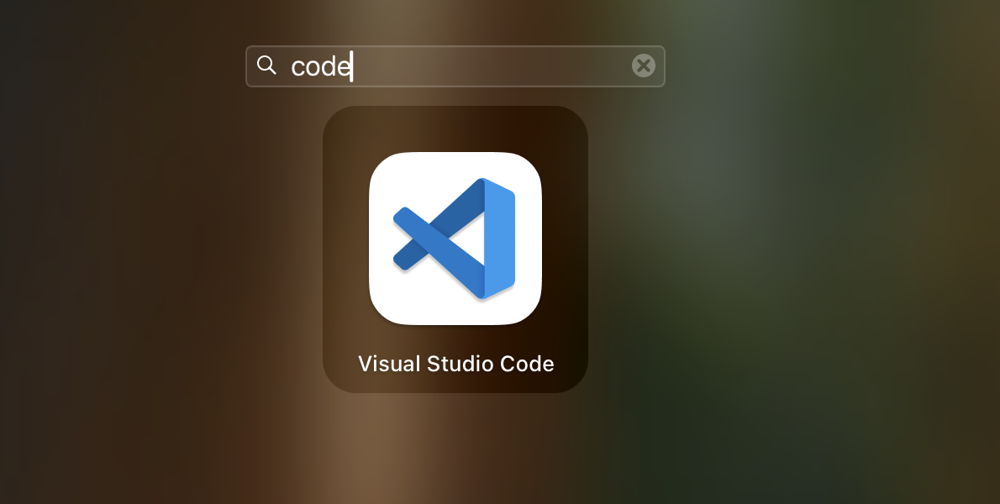
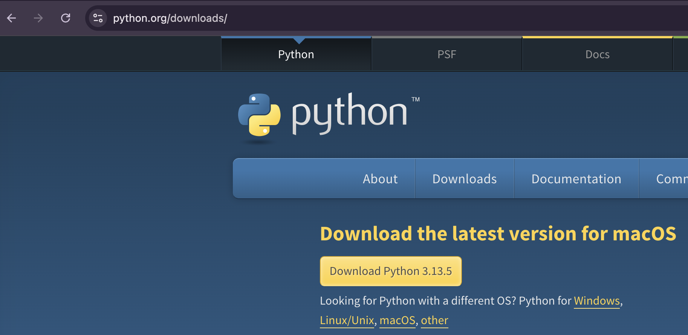
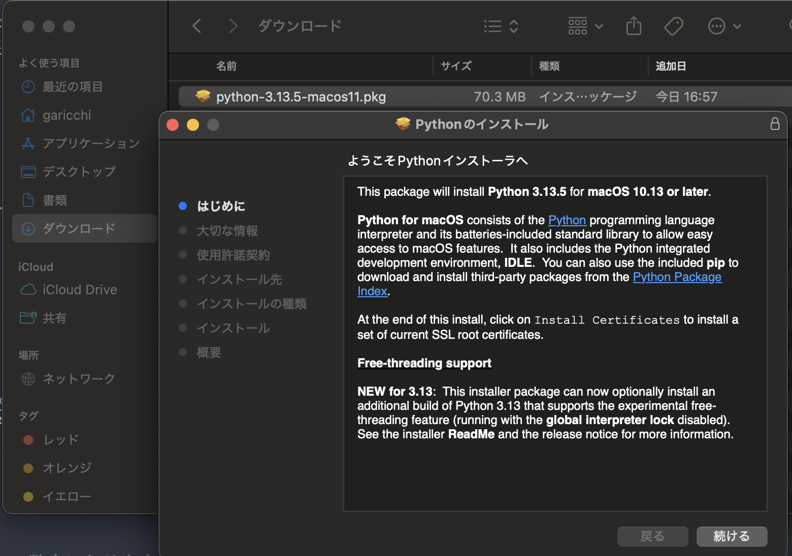
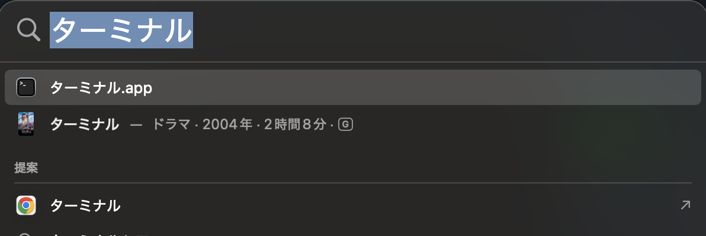
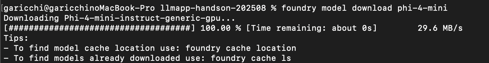

# ハンズオン事前準備資料 Mac版

## 必要なもの
1. MacOSのPC
1. Visual Studio Code (エディタ)
1. Python実行環境
1. homebrew
1. git
1. Azure AI Foundry Local　
1. LLMモデルのダウンロード

## Visual Studio Codeのインストール

コードを書くエディタのため、Visual Studio Codeをインストールします

> [!NOTE]
> プログラミングに慣れている方で、お好きなエディタがある場合は、インストールをスキップしていただいて問題ありません

[https://code.visualstudio.com/](https://code.visualstudio.com/) をブラウザで開き、
 `Download for macOS` を押します



ダウンロードフォルダを開き、 `VSCode-darwin-universal.zip` をダブルクリックで解凍します。



解凍された `Visual Studio Code` という名前のファイルを `アプリケーション` フォルダにドラッグ&ドロップで移動させます。



> [!NOTE]
> 左のサイドバーにアプリケーションフォルダが無い場合は、
> Finderのメニューから ファイル > 新規Finderウインドウを押し、
> その後メニューの 移動 > アプリケーションを選択し、表示してください

インストールされれば、アプリ一覧 (launchpad)に表示されます。



## Pythonのインストール

Pythonというプログラミング言語の環境をインストールします。

> [!WARNING]
> すでにPython3系を使用されている方はスキップで大丈夫です。

[https://www.python.org/downloads/](https://www.python.org/downloads/) をブラウザで開き、`Download Python 3.**` をクリックしてインストーラーをダウンロードします。

> [!NOTE]
> `**` の部分はその時の最新バージョンの数字になります。



ダウンロードフォルダを開き、ダウンロードしたインストーラーをダブルクリックして起動します。

インストーラーの指示にしたがって、インストールをします。



## homebrewのインストール

Macのパッケージマネージャであるhomebrewをインストールします。

`ターミナル` アプリを起動し、以下をコピペして入力します。

```
/bin/bash -c "$(curl -fsSL https://raw.githubusercontent.com/Homebrew/install/HEAD/install.sh)"
```

> [!NOTE]
> ターミナルアプリの起動がわからない場合は、Commandキーとスペースキーを同時に押し、Spotlightを起動します。
> 入力画面に `ターミナル` と入力して、起動します




## git
`ターミナル` アプリにて、下記コマンドを実行し、gitのバージョン番号が表示されれば大丈夫です。

```
git -v
```

> [!NOTE]
> 古めのMacOSでは、gitコマンドがエラーになる場合があります。
> もしも、error:のような文字が表示された場合は、以下のコマンドを実行し、再度git -vでエラーが出ないことを確認してください。
> ```
> xcode-select --install
> ```

> [!WARNING]
> xcode-select --installは完了までに時間がかかります
> お持ちのMacOSが古い場合は、なるべく事前に確認していただけると助かります

## Azure AI Foundry Localのインストール

`ターミナル` アプリを開き、以下の2つのコマンドを入力してAzure AI Foundry Localをインストールします。

```
brew tap microsoft/foundrylocal
```
```
brew install foundrylocal
```

## LLMモデルのダウンロード

下記コマンドで、 `phi-4-mini` という名前のモデルをダウンロードします

> [!NOTE]
> 約5GBほど、ダウンロードとディスク消費が発生します。
> 当日、会場でダウンロードされる方やディスク容量が気になる方は、下記にある `[必要な方のみ] 軽量版のLLMモデルをダウンロードする` を実施してください

> [!WARNING]
> ハンズオン会場のネットワーク負荷にならないように、会場でのダウンロードの場合はなるべく軽量版の手順でダウンロードを行なってください

```
foundry model download phi-4-mini
```



## [必要な方のみ] 軽量版のLLMモデルをダウンロードする

`qwen2.5-0.5b` というモデルの場合、800MBのダウンロードに抑えることができます。

ただし、回答の性能は下がるため、当日会場でダウンロードされる方やディスク容量が気になる方は、こちらを実施してください。

```
foundry model download qwen2.5-0.5b
```


## おわりに
お疲れ様でした！

以上で事前準備は完了です。

事前準備の中で、困ったことがあればconnpassのページのお問い合わせより、ご連絡ください。
