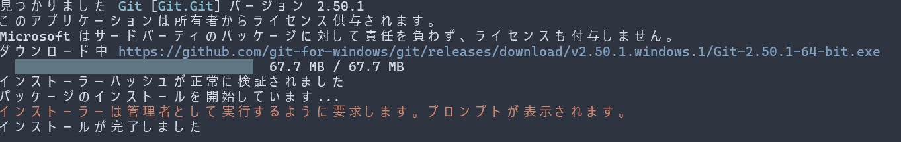

# ハンズオン事前準備資料 Windows版

## 必要なもの
1. Windows 11、もしくは最新版のWindows 10
1. Visual Studio Code (エディタ)
1. Python実行環境
1. git
1. Azure AI Foundry Local
1. LLMモデルのダウンロード

## Visual Studio Codeのインストール
コードを書くエディタのため、Visual Studio Codeをインストールします

> [!NOTE]
> プログラミングに慣れている方で、お好きなエディタがある場合は、インストールをスキップしていただいて問題ありません

[https://code.visualstudio.com/](https://code.visualstudio.com/) をブラウザで開き、
 `Download for Windows` を押します

ダウンロードフォルダに `VSCodeUserSetup` という名前のインストーラーがダウンロードされるので、ダブルクリックで起動します


インストーラーの指示に従ってインストールします。

下図のようにインストール完了とでればOKです。


## Pythonのインストール
Pythonというプログラミング言語の環境をインストールします。

> [!WARNING]
> すでにPython3系を使用されている方はスキップで大丈夫です。

[https://www.python.org/downloads/](https://www.python.org/downloads/) をブラウザで開き、`Download Python 3.**` をクリックしてインストーラーをダウンロードします。

> [!NOTE]
> `**` の部分はその時の最新バージョンの数字になります。


ダウンロードフォルダにダウンロードされた、インストーラーを起動します。


インストーラーが起動したら、`Add python.exe to PATH` にチェックを入れ、 `Install Now` を押してインストールを進めます。


`Setup was successful` と表示されたら、インストール成功です。


## Powershellの起動
ここから先の手順はターミナルで行います。

Windowsの場合は、 Powershellを利用します。

`Windowsキー` もしくは `スタートメニュー` から、検索ボックスに `powershell` と入力し、`Windows Powershell` を起動します。


## gitクライアントのインストール
gitリポジトリを操作するために、gitをインストールします。

> [!NOTE]
> プログラミングに慣れている方で、お好きなgitクライアントがある場合は、インストールをスキップしていただいて問題ありません

先程のWindows Powershellの画面で、下記コマンドを入力します

```
winget install --id Git.Git -e --source winget
```

`インストールが完了しました` と表示されれば成功です。



## Azure AI Foundry Localのインストール

Windows Powershellの画面で、下記コマンドを入力します

```
winget install Microsoft.FoundryLocal
```


## LLMモデルのダウンロード

下記コマンドで、 `phi-4-mini` という名前のモデルをダウンロードします

> [!NOTE]
> 約5GBほど、ダウンロードとディスク消費が発生します。
> 当日、会場でダウンロードされる方やディスク容量が気になる方は、下記にある `[必要な方のみ] 軽量版のLLMモデルをダウンロードする` を実施してください

> [!WARNING]
> ハンズオン会場のネットワーク負荷にならないように、会場でのダウンロードの場合はなるべく軽量版の手順でダウンロードを行なってください

```
foundry model download phi-4-mini
```


## [必要な方のみ] 軽量版のLLMモデルをダウンロードする

`qwen2.5-0.5b` というモデルの場合、800MBのダウンロードに抑えることができます。

ただし、回答の性能は下がるため、当日会場でダウンロードされる方やディスク容量が気になる方は、こちらを実施してください。

```
foundry model download qwen2.5-0.5b
```

## PCの再起動
ここまで来たら、最後にPCを再起動してください。

## おわりに
お疲れ様でした！

以上で事前準備は完了です。

事前準備の中で、困ったことがあればconnpassのページのお問い合わせより、ご連絡ください。

